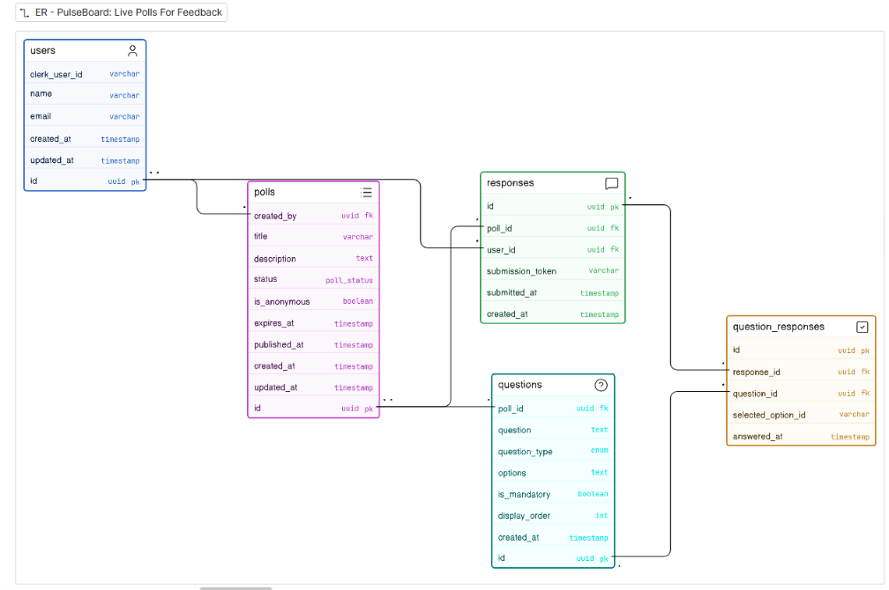

## Real time Polling app

User submits answer
│
▼
INSERT into question_responses ← source of truth
│
▼
Compute points (correctness + speed bonus)
│
▼
UPDATE session_participants ← totalPoints += earned
SET totalPoints = totalPoints + X
│
▼
Recalculate ranks for session ← optional, can do client-side
│
▼
Publish leaderboard event ← WebSocket broadcast
to all session subscribers


ERD

```TS
users [icon: user, color: blue] {
  id uuid pk
  clerk_user_id varchar
  name varchar
  email varchar
  created_at timestamp
  updated_at timestamp
}

polls [icon: list, color: purple] {
  id uuid pk
  created_by uuid fk
  title varchar
  description text
  status poll_status
  is_anonymous boolean
  expires_at timestamp
  published_at timestamp
  created_at timestamp
  updated_at timestamp
}

questions [icon: help-circle, color: teal] {
  id uuid pk
  poll_id uuid fk
  question text
  question_type enum
  options text
  is_mandatory boolean
  display_order int
  created_at timestamp
}

responses [icon: message-square, color: green] {
  id uuid pk
  poll_id uuid fk
  user_id uuid fk nullable
  submission_token varchar nullable
  submitted_at timestamp
  created_at timestamp
}

question_responses [icon: check-square, color: orange] {
  id uuid pk
  response_id uuid fk
  question_id uuid fk
  selected_option_id varchar nullable
  answered_at timestamp
}

// one user creates many polls (user must exist)
users.id < polls.created_by

// one user submits many responses (nullable — anonymous allowed)
users.id <? responses.user_id

// one poll has many questions (poll must exist)
polls.id < questions.poll_id

// one poll receives many responses (poll must exist)
polls.id < responses.poll_id

// one response contains one or more question_responses (must have at least one)
responses.id < question_responses.response_id

// one question answered across many question_responses (zero or many)
questions.id < question_responses.question_id
```

User creates poll
│
▼
status = "draft"
│
│ Add questions + options freely
│ Edit / delete / reorder
│
▼
status = "active" ←── creator hits "Go Live"
│ shareable link is now valid
│
│ Respondents submit answers
│
├──── expiresAt passes ──────────► status = "expired"
│ │
│ │ no more submissions
│ ▼
│ creator reviews analytics
│ │
└───────────────────────────────────────▼
status = "published"
public can see results
via same poll link
